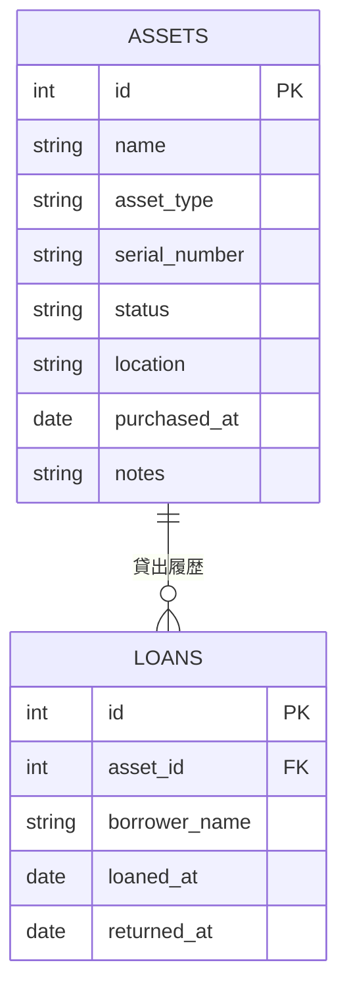

# 研究室デバイス 台帳管理ツール

研究室内のデバイスを一元管理するための台帳管理ツールです。
CLIもしくはUIの両方から操作でき、Docker環境で簡単に起動して利用します。

---

## 制作動機

研究室では、デバイスの故障や買い足し、メンバの入れ替わりによるデバイス再割り当てなどが行われるため、管理の一元化が求められます。私は研究室内で環境班というロールがあり、これらを管理する立場でしたが、事実、研究室内では以下の問題と課題が生じました。

- 筐体Aに複数人が接続して実験を回す
- 研究を引き継ぐ際に、PCを起動してフォルダを見てから旧利用者を特定していた
- 廃棄予定デバイスと現役デバイスが把握しにくい

本ツールはこれらの課題を解決するために開発しました。また、バックエンドにSQLiteを使用することで、インストールを最小限に抑えたため、ローカルのノートPCなどでの軽量化した活用が可能です。

---

## 本ツールの機能一覧

| 機能 | 説明 |
|:------:|------|
| 機器登録・編集・削除 | PC、モニター、周辺機器などの情報を管理 |
| 貸出・返却管理 | 誰がいつ借りて返したかを記録・追跡 |
| 検索・フィルター | 機器名、ステータス、担当者などで絞り込み |
| CSVエクスポート | 台帳データをCSVで出力（報告用） |
| 廃棄・ステータス管理 | 使用中 / 保管中 / 貸出中 / 廃棄で管理 |
| Web UI | ブラウザから台帳を閲覧・操作 |
| CLI | ターミナルから直接操作可能 |

---

## 技術スタック

| 分類 | 技術 |
|:------:|------|
| 言語 | Python 3.11 |
| DB | SQLite3 |
| Web フレームワーク | Flask |
| コンテナ | Docker / Docker Compose |
| フロントエンド | HTML + Jinja2テンプレート |
| テスト | pytest |

---

## ディレクトリ構成

```
.
├── app/
│   ├── main.py          # CLIエントリーポイント
│   ├── web.py           # Flask Webアプリ
│   ├── models.py        # DBモデル定義
│   ├── db.py            # DB接続・初期化
│   ├── templates/       # HTMLテンプレート
│   └── static/          # CSS等
├── data/
│   └── assets.db        # SQLiteデータベース
├── tests/
│   └── test_models.py   # ユニットテスト
├── Dockerfile
├── docker-compose.yml
├── requirements.txt
└── README.md
```

---

## セットアップ・起動方法

### Docker（推奨）

```bash
git clone https://github.com/your-username/asset-manager.git
cd asset-manager
docker-compose up --build
```

現状はブラウザで `http://localhost:5000` を開くとWeb UIが起動します。
Dockerfileの設定でポートを変更して利用できます。

---

### ローカル環境（Pythonのみ）

```bash
# リポジトリのクローン
git clone https://github.com/your-username/asset-manager.git
cd asset-manager

# 仮想環境の作成と有効化
python -m venv venv
source venv/bin/activate
# Windows: venv\Scripts\activate

# 依存パッケージのインストール
pip install -r requirements.txt

# DBの初期化
python app/db.py init

# Web UI の起動
python app/web.py

# CLI の起動
python app/main.py --help
```

---

## CLIの使い方

```bash
# デバイスを登録する
python app/main.py add --name <DEVICE NAME>> --type <DEVICE> --serial <SERIAL NUMBER> --status <STATUS>

# 一覧を表示する
python app/main.py list

# デバイスを検索する
python app/main.py list --status <STATUS>

# デバイスを貸し出す
python app/main.py lend --id <DEVICE ID> --to <NAME> --date <yyyy-mm-dd>

# デバイスを返却する
python app/main.py return --id <DEVICE ID>

# CSVにエクスポートする
python app/main.py export --output examle.csv

# デバイスを廃棄済みに変更する
python app/main.py update --id <DEVICE ID> --status <STATUS>
```

---

## データベース設計



---

## ステータス定義

| ステータス | 説明 |
|:------------:|------|
| `使用中` | メンバが使用している |
| `保管中` | 備品室で保管中 |
| `貸出中` | 貸し出し中 |
| `修理中` | 修理を行っている |
| `廃棄済み` | 廃棄処分済み|

---

## テストの実行

```bash
pytest tests/
```

---

## 今後の拡張予定

- [ ] ユーザー認証機能（ログイン）
- [ ] メール通知（貸出期限アラート）
- [ ] 機器ラベルのQRコード生成
- [ ] PostgreSQL対応（大規模環境向け）

---

## 設計上の判断・工夫

- **SQLiteを採用した理由**：外部DBサーバーなしで動作させることで、小規模な社内環境でも導入コストを最小化したかったからです。将来的にはPostgreSQLへの移行も容易な設計にしています。
- **CLI + Web UIの両対応**：自動化スクリプトや他ツールとの連携はCLIで、日常的な確認・操作はWebブラウザで行えるよう設計しました。
- **廃棄済み機器の論理削除**：物理削除ではなくステータス変更で対応することで、監査・履歴確認に耐えられるデータ設計にしました。

---

## ライセンス

MIT License
